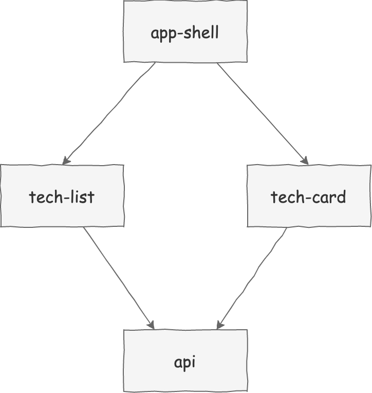

# micro-frontends-app

Simple Micro Frontends Application with Svelte and React



## Build and Run the App

```bash
> docker-compose up --build
> open http://localhost:8000
```

## Learn Micro Frontends

- https://martinfowler.com/articles/micro-frontends.html
- https://medium.com/@lucamezzalira
- https://medium.com/@lucamezzalira/micro-frontends-resources-53b1ec7d512a
