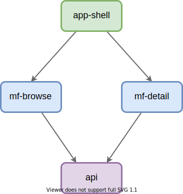

# Micro Frontends App

This repository contains an implementation of a simple micro frontends application written in Svelte and React.

## Brief Intro to Micro Frontends

- Micro frontends is more or less the same thing on the frontend side, as microservices are on the backend side.
- Instead of building huge monolithic applications, we compose our applications from a set of **well-defined, loosely coupled components**. This brings many advantages.
- Adopting micro frontends enables **easier team setup**, where each micro frontend is owned by a single cross-functional team.
- Each team can independently choose what frontend technologies and build tools they use. The possibility to use **multiple frontend technologies in same application** effectively prevents technology lock-in situation. It also makes applications more future-proof, allowing teams to more easily experiment and migrate to new technologies.
- We also get **independent updates**, so that if one part of the application requires changes, we only need to update and deploy the micro frontend that implements the desired functionality. The rest of the application stays untouched.
- As with microservices in the backend side, a very important thing is to **identify micro frontends** in our frontend applications. Fortunately, exactly the same principles, such as **Domain Driven Desing (DDD)** apply to frontends too.
- Micro frontend methods can also be very effective when we want to migrate an existing monolithic single page application (SPA) to a more modular architecture. Here we usually utilize so called **Strangler Pattern**, where we kill the monolith by eating it piece-by-piece, until there are nothing left from the original implementation.
- Micro frontends approach has many advantages, but **it is no silver bullet**. It also comes with its own challenges, such as operational and governance complexity, and possibly bigger payload sizes. The important thing is to **understand the trade-offs** to make an informed decision on what's best for you and your team.

### Recommended Reading

- https://martinfowler.com/articles/micro-frontends.html
- https://medium.com/@lucamezzalira
- https://medium.com/@lucamezzalira/micro-frontends-resources-53b1ec7d512a

## Application Components



### Application Shell (`app-shell`)

- Gateway to the application.
- Implements client-side routing.
- Loads (lazy), mounts, and unmounts micro frontends based on application state.
- Technologies: [Svelte](https://svelte.dev/), [Immer](https://immerjs.github.io/immer/), [Router5](https://router5.js.org/), [Axios](https://github.com/axios/axios), [Snowpack](https://www.snowpack.dev/)

### Browse Micro Frontend (`mf-browse`)

- Implements browse experience.
- Shows a list of selectable items.
- Technologies: [React](https://reactjs.org/), [Axios](https://github.com/axios/axios), [Snowpack](https://www.snowpack.dev/)

### Detail Micro Frontend (`mf-detail`)

- Implements detail experience.
- Shows some details about the selected item.
- Technologies: [Svelte](https://svelte.dev/), [Axios](https://github.com/axios/axios), [Snowpack](https://www.snowpack.dev/)

### Backend (`api`)

- Provides JSON data and images for the application.

## Styling Solution

Application shell and the micro frontends use [Bootstrap](https://getbootstrap.com/) for styling.

## Cross-Application Communication

Application shell and the micro frontends can communicate in a loosely coupled way by using the standard [Custom Events API](https://developer.mozilla.org/en-US/docs/Web/Guide/Events/Creating_and_triggering_events).

## Building and Running the App

```bash
> docker-compose up --build
> open http://localhost:8000
```
